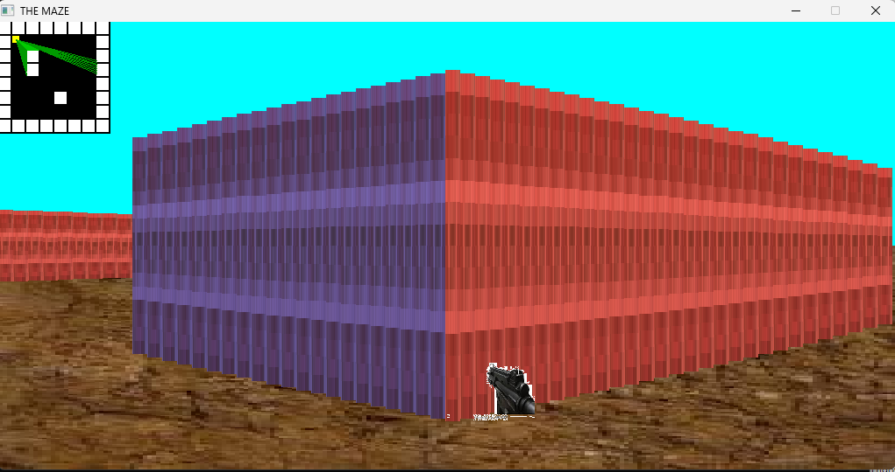

# MAZE

## Introduction

MAZE is a simple 3D game developed using SDL2 and raycasting techniques. It simulates a 3D maze environment where players can navigate, interact with walls, and experience basic 3D rendering. The project features a raycasting engine for rendering walls, player movement controls, and elements like weapons and enemies. This project is a great example of fundamental 3D game development using SDL2.

**Deployed Site:** [Watch the demo on YouTube](https://youtu.be/tOl8FLGQvOE)  
**Final Project Blog Article:** [LinkedIn Article](https://www.linkedin.com/posts/dawit-zeyede10_linkthe-maze-activity-7242053902056013826-Cwqc?utm_source=share&utm_medium=member_desktop)  
**Author LinkedIn:** [Dawit Zeyede](https://www.linkedin.com/in/dawit-zeyede10/)

## Installation

To set up and run the MAZE project on your local machine, follow these steps:

1. **Clone the Repository:**
    ```bash
    git clone https://github.com/Dawit-Zeyede/Alx-maze.git
    cd Alx-maze
    ```

2. **Install Dependencies:**
    Ensure you have SDL2 and SDL2_image libraries installed. On Debian-based systems, you can use:
    ```bash
    sudo apt-get install libsdl2-dev libsdl2-image-dev
    ```

3. **Build the Project:**
    Compile the project using `gcc` with the following command:
    ```bash
    gcc -Wall -Werror -Wextra -pedantic -o maze src/*c -lSDL2 -lSDL2_image -lm
    ```

4. **Run the Application:**
    Execute the compiled binary:
    ```bash
    ./maze
    ```

## Usage

Once the application is running, you can control the player using the following keys:
- `W` - Move forward
- `S` - Move backward
- `A` - Turn left
- `D` - Turn right
- Arrow Keys - Rotate the view
- `M` - Toggle the visibility of the 2D map

## Contributing

Contributions to the MAZE project are welcome! To contribute:

1. Fork the repository.
2. Create a feature branch (`git checkout -b feature-branch`).
3. Commit your changes (`git commit -am 'Add new feature'`).
4. Push to the branch (`git push origin feature-branch`).
5. Create a new Pull Request.

Please make sure to follow the coding style and include tests for new features.

## Related Projects

- [Alx-maze_landing](https://github.com/Dawit-Zeyede/Alx-maze_landing) - Description of related project.

## Licensing

No license has been specified for this project.

## Screenshots



